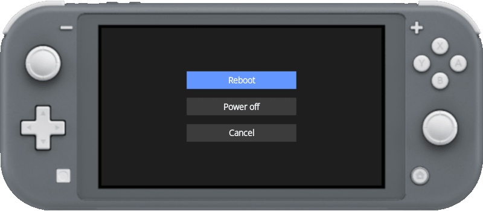

# Easy Power Menu

Easy Power Menu is a easy way to power off or reboot your Nintendo Switch without having to hold the power button.



## Installation

Access the [releases page](), download the latest .nro file and copy it to the "switch" folder on your sd card.

## Creating a shortcut on Switch home screen

- Access [nsp-forwarder.n8.io](https://nsp-forwarder.n8.io/), or download any offline NSP forwarder tool.
    - Use [this image](icon.jpg) as app icon.
    - In the "App title" field, enter "Easy Power Menu".
    - In the "NRO Path" field, enter "/switch/easypm.nro".
    - In the "Prod keys" field, upload your "prod.keys" file. (usually  in the "switch" folder on the sd card).
    - Generate the NSP file.
    - Install it using Tinfoil, DBI or any other similar tool.

## Building

- Requirements
    - [devkitPro](https://github.com/devkitPro/installer/releases)
    - [VSCode](https://code.visualstudio.com/download)
    - SDL2 and SDL2-TTF portlibs
        - After installed devkitPro, run MSYS2 (Windows Start Menu > Type "MSYS2")
        - On MSYS2 execute the command:
            ```console
            pacman -S switch-sdl2 switch-sdl2_ttf --noconfirm
            ```
- Setup the environment variable
    - On `.vscode/c_cpp_properties.json` - line 3, set your devkitPro installation directory to the "DEVKITPRO" variable. (By default "C:/devkitPro").
    
        ```json
        {
            "env": {
                "DEVKITPRO": "C:/devkitPro"
            },
            ...
        }
        ```
- Open VSCode Terminal or Windows Command Prompt, make sure you are in the project root directory, and run the "make" command:
    ```console
    make
    ```
    The .nro file will be generated at the project root folder.

## Debugging
- Build your project.
- On Nintendo Switch, open the hbmenu (Gallery icon).
- On hbmenu, press the "Y" button to start the NetLoader. Take note of the IP address that will be displayed.
- On Windows, open the Command Prompt and navigate to the devkitPro installation directory. Then navigate to the "`tools/bin`" folder.
- Run the following command:
    ```console
    nxlink -a <Nintendo Switch IP Address> -s <project directory>\epmenu.nro
    ```
    Replace `<Nintendo Switch IP Address>` with the address shown in NetLoader.
    
    Replace `<project directory>` with the location where you downloaded this project.

    After running the command, the .nro file will be uploaded to the Nintendo Switch and the outputs (like printf logs) will be shown in the Command Prompt.